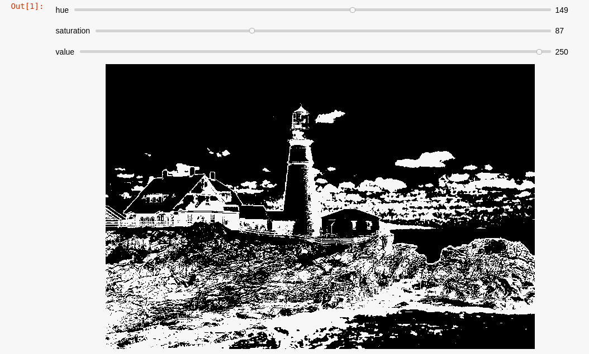

# [RGB to HSV and thresholding](@id rgb_hsv_thresholding)

This example illustrates how RGB to HSV (Hue, Saturation, Value) conversion
can be used to facilitate segmentation processes.
A simple segmentation of the image can then be effectively performed 
by a mere thresholding of the HSV channels.


```julia
using Images, TestImages, LinearAlgebra, Interact, ImageView

rbg_img = testimage("lighthouse")
hsv_img = HSV.(rbg_img)
channels = float(channelview(hsv_img))

hue_img = channels[1,:,:]
value_img = channels[3,:,:]
saturation_img = channels[2,:,:]
binary_img = zeros(size(hue_img))
@manipulate for hue in 0:255, saturation in 0:255, value in 0:255
    fill!(binary_img, 0.0)
    for ind in eachindex(hue_img)
        if hue_img[ind] <= hue && saturation_img[ind] <= saturation/255 && value_img[ind] <= value/255 
            binary_img[ind] = 1
        end
    end
    colorview(Gray, binary_img)
end
```

Here's the result in IJulia:



You can click on the slider bars to change the threshold
of hue, saturation and value.
The obtained binary image can be used as a mask on the
original RGB image.
