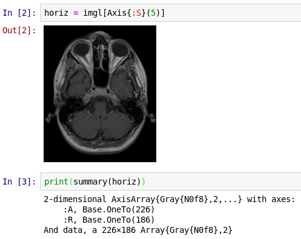

# Arrays: more advanced indexing

In addition to the handling of numbers and colors, one of the main
ways that JuliaImages leverages Julia is through a number of more
sophisticated indexing operations. These are perhaps best illustrated
with examples.

## Keeping track of location with unconventional indices

Consider the following pair of images:

| imgref | img |
|:------:|:---:|
|  |  |

You might guess that the one on the right is a rotated version of the
one on the left. But, what is the angle? Is there also a translation?

A "low tech" way to test this is to rotate and shift the image on
the right until it seems aligned with the one on the left. We could
overlay the two images
([Using colorview to make color overlays](@ref)) to see how well we're
doing.

```jldoctest; setup = :(using Images; img = load(joinpath(@__DIR__, "src/assets/indexing/cmrot.png")))
julia> using Images, CoordinateTransformations

julia> tfm = recenter(RotMatrix(pi/8), center(img))
AffineMap([0.92388 -0.382683; 0.382683 0.92388], [88.7786, -59.3199])

julia> imgrot = warp(img, tfm);

julia> summary(img)
"386×386 Array{Gray{N0f8},2} with eltype Gray{Normed{UInt8,8}}"

julia> summary(imgrot)
"OffsetArray(::Array{Gray{N0f8},2}, -59:446, -59:446) with eltype Gray{Normed{UInt8,8}} with indices -59:446×-59:446"
```

While `img` has axes that start with the conventional 1, the
summary of `imgrot` reports that it has axes `(-59:446, -59:446)`.
This means that the first element of `imgrot` is indexed with
`imgrot[-59,-59]` and the last element with `imgrot[446,446]`.

What is the meaning of these indices that extend beyond those of the
original array in both directions? Displaying the rotated
image---especially when overlaid on the original---reveals why:

```julia
julia> imgov = colorview(RGB, paddedviews(0, img, imgrot, zeroarray)...)
```


The padding on all sides of the array leaves space for the fact that
the rotated image (green) contains some pixels out of the region
covered by the original image (red).  The fact that Julia allows these
indices to be *negative* means that we have no trouble adding
appropriate "padding" to the original image: we just copy the
original over to the padded array, using its original indices.

We can test whether `imgrot` aligns well with the original
unrotated image `imgref` at the top of this page:

```julia
julia> imgov_ref = colorview(RGB, paddedviews(0, imgref, imgrot, zeroarray)...)
```


The fact that the overlapping portion looks yellow---the combination
of red and green---indicates that we have perfect alignment.

You can learn more about Julia's support for arbitrary indices in
[this blog post](https://julialang.org/blog/2017/04/offset-arrays).

## Keeping track of orientation with named axes

Suppose you are presented with a 3-dimensional grayscale image. Is this a movie (2d over time), or a 3d image (x, y, and z)? In such situations, one of the best ways to keep yourself oriented is by naming the axes.
The TestImages package contains an example of a file that illustrates this:

```julia-repl
julia> using Images, TestImages

julia> img = testimage("mri");

julia> println(summary(img))
3-dimensional AxisArray{Gray{N0f8},3,...} with axes:
    :P, 0:1:225
    :R, 0:1:185
    :S, 0:5:130
And data, a 226×186×27 Array{Gray{N0f8},3} with eltype Gray{Normed{UInt8,8}}
```

TestImages uses the [AxisArrays package](https://github.com/JuliaArrays/AxisArrays.jl) to name the axes of
this particular image in terms of the [RAS coordinate system](http://www.grahamwideman.com/gw/brain/orientation/orientterms.htm) (Right, Anterior, Superior) as commonly used in magnetic resonance imaging.
See the documentation for that package to learn more about how you can create your own `AxisArray` objects.

We can use this coordinate system to help with visualization. Let's look at a "horizontal slice," one perpendicular to the superior-inferior axis (i.e., a slice with constant `S` value):



From the summary you can see that the slice has just the `:A` and `:R` axes remaining.

We could slice along the `R` and `A` axes too, although for this image (which is sampled very anisotropically) they are not as informative.

The [ImageAxes](https://github.com/JuliaImages/ImageAxes.jl) and
[ImageMetadata](https://github.com/JuliaImages/ImageMetadata.jl)
packages add additional functionality to AxisArrays that may be useful
when you need to encode more information about your image.
